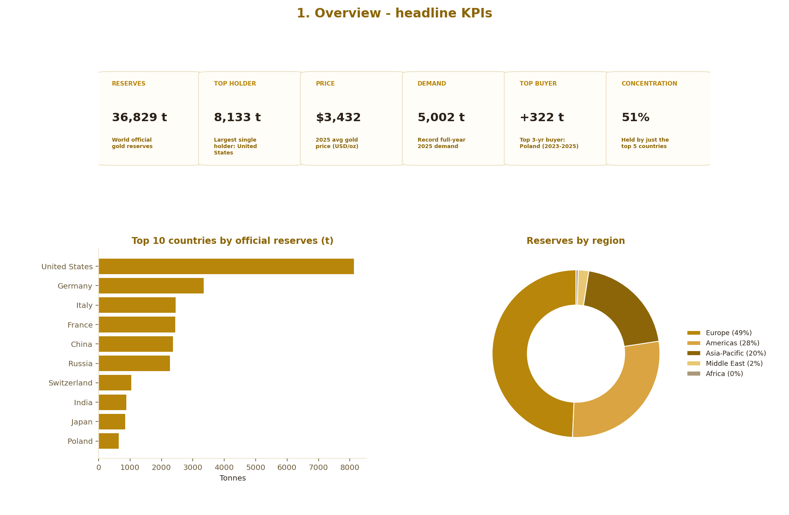
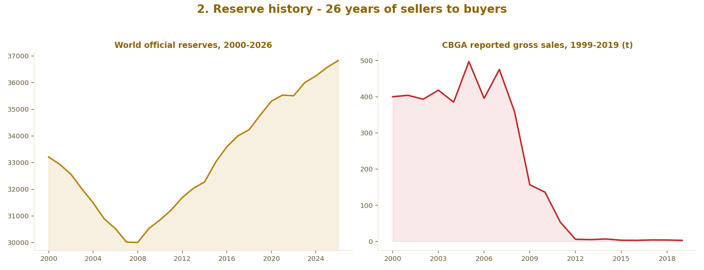
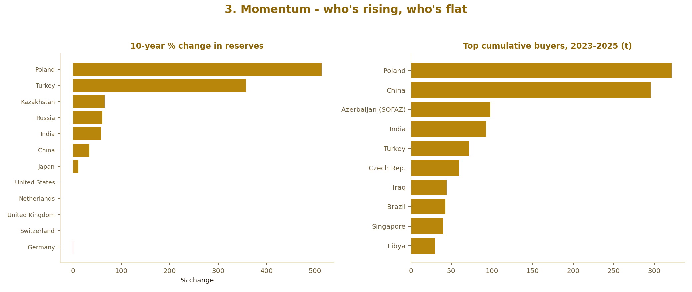
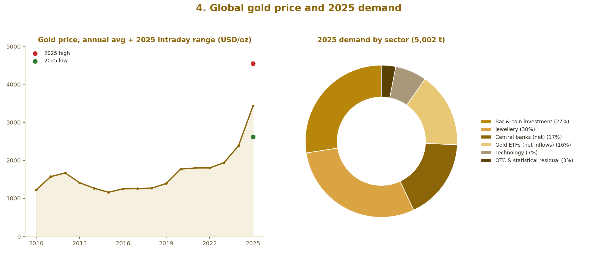

# 🪙 Global Gold Market Pulse — 2026 Edition

**Which country actually holds the most gold — and who's been quietly buying the most of it?**
An interactive, source-cited BI dashboard on world official gold reserves, mine production, 26 years
of reserve history, and 2025's record demand, published for **2026** — built end-to-end on **real
World Gold Council / IMF IFS and USGS data**, with a Python pipeline that outputs both a formatted
Excel workbook (native charts) and a lightweight, dependency-free HTML dashboard.



---

## 📸 Dashboard preview

The live dashboard is fully interactive (sortable tables, a zoomable world map, a country explorer,
CSV export); the images below are styled renders of its key sections built from the same real data
pipeline, so you can see what's inside before opening `dashboard/index.html` yourself.


**② Reserve history** — 26 years of world official reserves (the 2000-2008 selling era followed by
the 2009-2026 buying era) next to the Central Bank Gold Agreement's collapsing sales figures.


**③ Momentum & buyers** — which countries grew their reserves fastest over the last decade, and who
has actually bought the most gold in the last three years.


**④ Global gold price & demand** — the world USD/oz price with 2025's intraday high/low marked,
next to the full breakdown of 2025's record demand by sector.


*(These images are generated by [`docs/screenshots/make_preview.py`](docs/screenshots/make_preview.py)
from the same `scripts/gold_data.py` dataset the live dashboard reads — not literal screenshots, since
this repo was built in an environment without a live browser, but a faithful preview of the same
charts, colors and numbers you'll see in `dashboard/index.html`.)*

---

**Data current as of:** September 2026 (World Gold Council / IMF IFS publication). This is a living
data project — see [`scripts/gold_data.py`](scripts/gold_data.py) for exactly how to refresh it with
a newer IFS extract in future years.

## 📌 The brief

> Build a world-class, end-to-end BI analysis of the global gold market that answers one question with
> total rigor: **which countries hold the most gold, who is accumulating it fastest, and where is the
> market heading?** Every figure must trace to a real, citable source — no synthetic or estimated
> numbers presented as fact. Ship it as a portfolio-grade GitHub repo: a Python ETL/reporting pipeline
> that produces a polished Excel workbook with native charts, plus a standalone white-background HTML
> dashboard that reads from that same pipeline's output and needs no server to run.

**Why this is a good BI portfolio piece:** it demonstrates the full loop a BI engineer is actually
hired for — sourcing and reconciling real primary data (IMF IFS reserve files) with secondary data
(USGS, WGC) that use *different methodologies*, being transparent about that instead of silently
blending it, building a repeatable Python-to-Excel reporting pipeline, and shipping a client-facing
interactive dashboard from the same single source of truth.

## 🔍 What the analysis found

- The **United States** holds by far the largest official gold reserve — **8,133.5 t**, ~22% of all
  IFS-reported world reserves — a position unchanged since the 1970s "gold window" era.
- The next four (**Germany, Italy, France, China**) combined don't quite reach the US total.
- The real story isn't the leaderboard, it's the **flow**: world official reserves fell almost every
  year from 2000–2008 (the Central Bank Gold Agreement selling era) and have risen almost every year
  since 2009.
- **Poland** is the standout accumulator of the decade — from 103 t in 2017 to **632 t by mid-2026**,
  including the single largest one-country buy of 2025 (+102 t) and the largest of 2026 YTD (+90 t).
- **China** has also been a persistent, large buyer (+296 t cumulative 2023–2025), while **Russia**
  actually *trimmed* its reserve slightly in 2025 after a decade of heavy buying.
- Gold *production* and gold *reserves* tell different stories: **China, Russia and Australia** mine
  the most gold, but Australia in particular holds comparatively modest official reserves relative to
  its output — production and central-bank policy are largely decoupled.
- 2025 was a record year for demand (**5,002 t / $555bn**) — driven overwhelmingly by **investment**
  (ETF inflows + bar/coin), not jewellery, whose *volume* fell 18% even as prices (and jewellery
  *value*) hit records.

## 📊 Live dashboard

Open `dashboard/index.html` directly in any browser — no server, build step, or internet connection
needed after the first load (charts/map libraries are loaded from a CDN; all data is baked in as a
static JS file, so the dashboard degrades gracefully offline for every section except the world map).

Sections: **Overview** (9 KPI tiles) · **Reserves by Country** (sortable/searchable leaderboard +
zoomable world map with a Reserves/Production layer toggle) · **Regions** (regional breakdown +
institutional/supranational holders) · **Gold Allocation** (de-dollarization leaderboard + Euro Area
vs. country bloc comparison) · **Country Explorer** (pick any of 29 countries for a full snapshot) ·
**Reserve History** (2000–2026 trend across 12 countries, with callouts for Brown's Bottom, the SNB
sales, and Türkiye's 2026 swing) · **CBGA Era** (the 1999–2019 selling agreements) · **Momentum**
(10-year % change by country) · **Buyers & Sellers** (who's actually accumulating) · **Reserve
Value** (USD value of holdings) · **Production** · **Price History** (world gold price, YoY change,
and price vs. central-bank buying) · **Demand & Supply** · **Outlook** (transparent trend model) ·
**Sources**.

## 📁 Repository structure

```
global-gold-market-pulse-2026/
├── scripts/
│   ├── gold_data.py          # single source of truth — every real figure + citation
│   └── build_workbook.py     # builds the Excel workbook AND dashboard/data/gold_data.js
├── output/
│   └── Global_Gold_Market_Pulse.xlsx   # generated workbook (9 sheets, native charts)
├── dashboard/
│   ├── index.html            # white-background dashboard shell
│   ├── app.js                # Chart.js + D3 rendering logic
│   ├── data/gold_data.js     # generated data file (window.GOLD_DATA)
│   └── assets/               # favicon, avatar
├── docs/screenshots/
│   ├── make_preview.py       # composes the README preview PNG from real data
│   └── preview.png
├── requirements.txt
├── publish.sh / publish.bat  # one-command GitHub publish scripts
└── .github/workflows/        # CI validation + GitHub Pages deploy
```

## ▶️ Reproduce it yourself

```bash
pip install -r requirements.txt
python scripts/build_workbook.py        # -> output/Global_Gold_Market_Pulse_2026.xlsx + dashboard/data/gold_data.js
python docs/screenshots/make_preview.py # optional: regenerate the README preview image
open dashboard/index.html               # or just double-click it
```

## 🧾 Data sources & methodology

| Dataset | Source | As of |
|---|---|---|
| Official gold reserves by country, reserve history (2000–2026), annual net changes | World Gold Council / IMF International Financial Statistics (Goldhub) | Sep 2026 publication |
| Gold mine production by country | USGS, *Mineral Commodity Summaries 2026* | 2025 estimate |
| Gold price, annual average | LBMA Gold Price, via BSP / metalcharts.org | 2010–2025 |
| Global gold demand by sector, supply | World Gold Council, *Gold Demand Trends* FY2025 | Full year 2025 |

The reserve, reserve-history and annual-change datasets are the **primary source** for this project:
real IMF IFS files downloaded directly from `gold.org/goldhub/data/gold-reserves-by-country`. Raw
source workbooks are not redistributed in this repo out of respect for the data provider's terms —
`scripts/gold_data.py` documents the exact file, sheet and figures used so the analysis is fully
auditable and reproducible from a fresh download. Production, price and demand figures are secondary
data, cited inline in `scripts/gold_data.py` and on the dashboard's Sources tab. The `Forecast` /
`Outlook` sections are an explicit, transparent trend-extrapolation model — not a market prediction.

## 👤 Author

**Milad Shabani** — BI Engineer (Power BI · DAX · SQL Server · SSIS/SSAS · Python)
[miladshabani.ir](https://miladshabani.ir)

## 📄 License

MIT — see [LICENSE](LICENSE).
